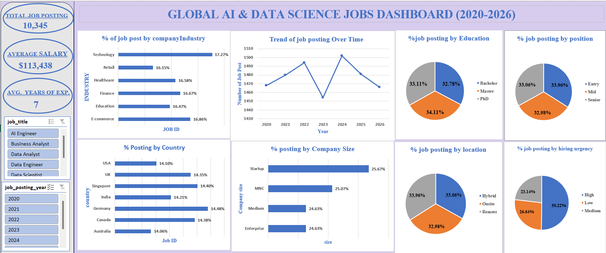

# DATA DRIVEN ANALYSIS OF THE GLOBAL DATA-AI JOB MARKET 2020-2026.

## INTRODUCTION 

## ABOUT THE DATASET

The AI & Data Science Job Market Dataset (2020–2026) is a synthetically generated dataset designed to simulate real-world hiring patterns across the artificial intelligence and data science 
job market.
The dataset contains structured information about job roles, company characteristics, required 
technical skills, education levels, experience requirements, and salary ranges. It reflects hiring data across multiple countries, industries, and company sizes.

## PROBLEM STATEMENT 

The data science field is one that continues to evolve rapidly as the years progress. In the age of artificial intelligence, there have also been significant shifts in the status quo.
This project seeks to explore the changing trends and patterns currently shaping the field, including areas such as salary across job titles, years of experience required, education level, and work location type (remote, onsite, or hybrid), among others.

## VISUALIZATION 

Microsoft Excel was used to design and develop this interactive dashboard for analyzing trends in the global AI and data science job market.

## INSIGHTS 

**Average Salary by Job Title:** Below is the average salary for the job titles posted over the 7-year perieriod:
Data Analvst $99,136
Data Scientist $99,646
Data Engineer- $99,741
Business Analyst-$101,642
Machine Learning Engineer - $139,705

AI Engineer - $139,945
These figures are arranged in ascending order.
2. Total Number of Job Postings: The total number of jobs posted from 2020 to 2026 is 10,345.
3. Lowest and Highest Job Posting Years: The years with the lowest and highest number of job postings were 2023 and 2024, respectively.
2023 - 1,452 job postings
2024 - 1,502 job postings
4. Variation in Education, Work Location, and Experience Level: Across the different job titles and years, there were variations in:
Education level (Bachelor's, Master's, PhD)

## RE
